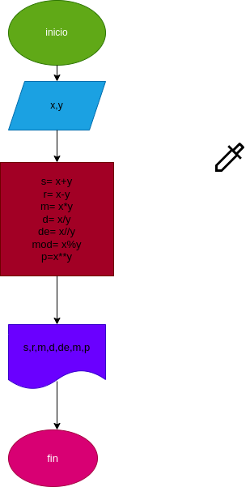

# operaciones-aritmetica
implementar un programa para calcular la suma ,resta ,multiplicación,división , división entera, modulo y potencia de dos números
## calcular mediante 2 numeros enteros varias operaciones aritmeticas

# analisis

-variables de entrada
 
 X y Y : 2 numeros naturales ingresados para sacarles sus operaciones aritmeticas respectivas

 -variables de salida

 S: suma
 R: resta 
 M: multiplicación
 D: división
 DE: division entera
 MOD: modulo
 P: potencia

 # Diseño
 

 # CONSTRUCCION

 ejercicio n.3 Implementar un programa para operaciones aritmeticas

 S: X+Y 
 R: X-Y 
 M: X * Y 
 D: X / Y 
 DE: X // Y
 MOD: X % Y 
 P: X ** Y 

 ## ESTE ARCHIVO ESTA ESCRITO EN LENGUAJE MARKDOWN
